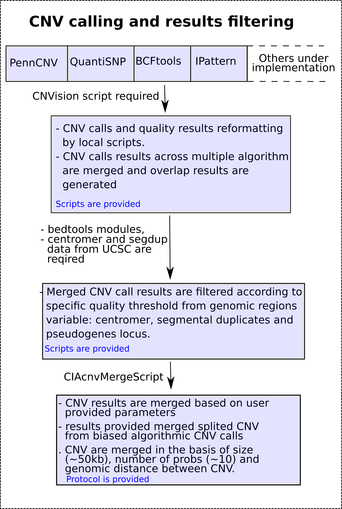

## CNV detection
<p align="center">
  
</p>

The PennCNV running dependencies are now satisfied. We can run the CNV detection by PennCNV or QuantiSNP, or by both together. In this example, we will call the CNVs by each algorithm separately. This process is entirely parallel with high efficiency. In order to activate the PennCNV CNV calling option, the user must provide the CNV detection option as "detect" and as always, set the PennCNV option to "True". Here is the command line example to call the CNV with PennCNV in parallel.

```bash
./cnvCallingPipelineWarper.sh 0 10 0-10 $PWD/PipelineInput.config True False detect
```

The results for 10 samples in parallel are generated in 45 seconds and use less than 1Mb of RAM memory. The PennCNV CNV detection results are saved in the below folder:

```bash
ls  /Path_to_the_pipeline_installation_repository/AnalysisScripts_CNVcalling/CNVpennCNV/BATCH_00/CNV_DATA
autosome_sample1.rawcnv
gonosome_sample1.rawcnv
autosome_sample2.rawcnv
gonosome_sample2.rawcnv
...
autosome_sample10.rawcnv
gonosome_sample10.rawcnv
```
Here is a print-screen example of PennCNV output results for sample1

<p align="center">
  
</p>

Now, we will show the example of CNV calling by the QuantiSNP algorithm. It's the same command line but the PennCNV algorithm execution Boolean will be set to False while the QuantiSNP one will be set to True alone. In this case, remember that the only valid CNV detection option is "detect", the two others are useless. The CNV calling by QuantiSNP is also entirely parallel. Here is the command line example for the QuantiSNP execution.

```bash
 ./cnvCallingPipelineWarper.sh 0 10 0-10 $PWD/PipelineInput.config False True detect
```
The analysis take ~4.5mn and use ~2Mb of RAM. The results are located in the following directory:
```bash
ls /Path_to_the_pipeline_installation_repository/AnalysisScripts_CNVcalling/CNVquantiSNP/BATCH_00/sample1.outdir
sample1.cnv
sample1.loh
sample1.qc
```

The QuantiSNP samples quality analysis generates quality assessment results per chromosome, since the users require often the quality results for the whole individuals array, then we provide a script which is able to averaged and standardize the quality values.
```bash
/script localisation/ to do
```
Here is the original print-screen for the QuantiSNP quality output. As we see the format is different from PennCNV one, therefore the standardization of both data formats is required. 

<p align="center">
  
</p>

Here is a print-screen example of the QuantiSNP CNV detection results output.
<p align="center">
  
</p>

