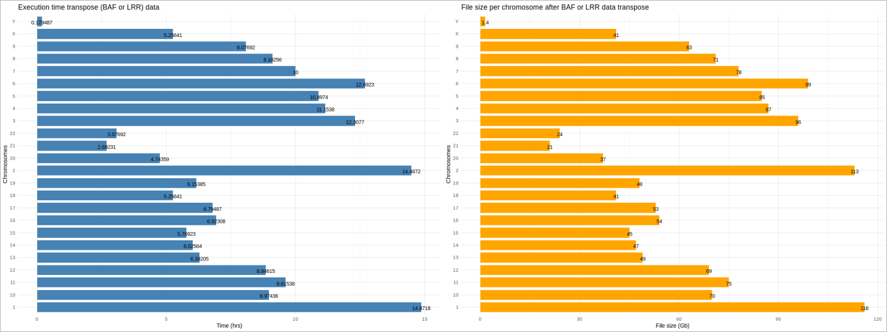
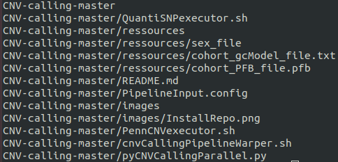
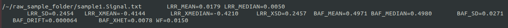
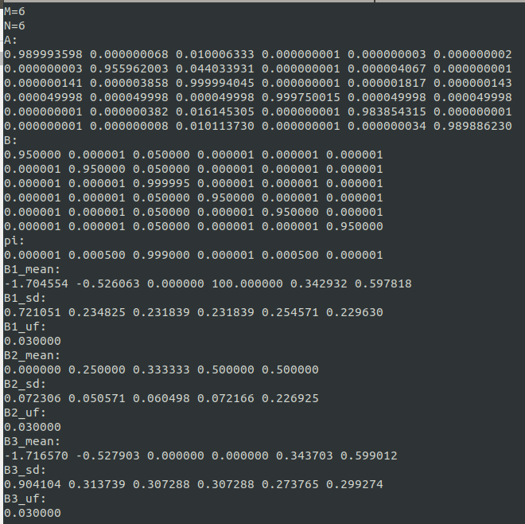
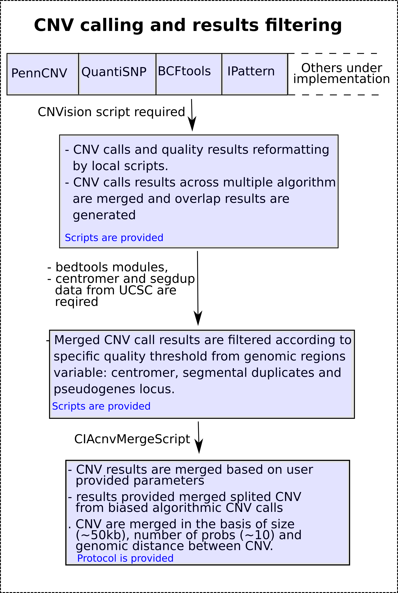
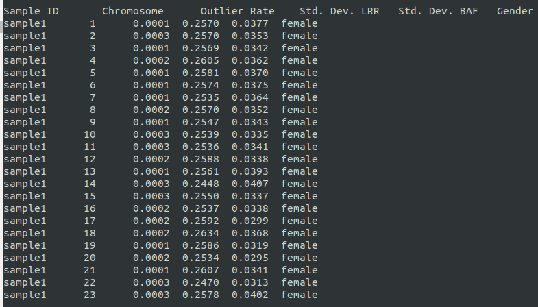

<p align="center">
  
</p>
Please click below to follow your selected CNV calling tutorial
      btn {
      position: absolute;
      top: 50%;
      left: 50%;
      display: inline-block;
      padding: 10px 25px;
      margin: 4px 2px;
      background-color: #82b74b;
      border: 3px solid #f0efef;
      border-radius: 5px;
      text-align: center;
      text-decoration: none;
      font-size: 20px;
      color: #fff;
      cursor: pointer;
      }

      btn1 {
      position: absolute;
      top: 50%;
      left: 80%;
      display: inline-block;
      padding: 10px 25px;
      margin: 4px 2px;
      background-color: #82b74b;
      border: 3px solid #f0efef;
      border-radius: 5px;
      text-align: center;
      text-decoration: none;
      font-size: 20px;
      color: #fff;
      cursor: pointer;
      }
  <body>
    <button class="btn" onclick="window.location.href = 'https://www.w3docs.com';" type="submit">Click<br />Me!</button><button class="btn1" onclick="window.location.href = 'https://www.w3docs.com';" type="submit">no Click<br />Me!</button>
  </body>
<p align="center">
  
</p>

[](https://doi.org/10.5281/zenodo.3497400)

[](https://mybinder.org/v2/gh/MartineauJeanLouis/MIND-GENESPARALLELCNV.git/master)[](https://circleci.com/gh/MartineauJeanLouis/MIND-GENESPARALLELCNV)

#### Description
Mind-GenesParallelCNV is freeware tool which mainly implemented to compute CNV calling parallel tasks in the most efficient method. The tool is design to make the command lines as much easier and simple as possible so that researchers form different informatics background level can integrate it in their research project. Also, It has been built to make the parallel tasks possible to be executed on any type of computer including desktops. The tools only work on linux64 for the moment. Other than focusing on calling CNV in parallel, the tool is meant to help detecting CNV using several type of callers based on different algorithms (implementation language may differ between algos). For the moment, the tool generates parallel calls from PennCNV and QuantiSNP, but other CNV caller such as IPattern, BCFtools, FastSeg, DNAcopy, etc will be implemented very soon so that better consensus results can be made available.

As indicated Mind&GenesParallelCNV is a freeware and opensource linux based tool, and users are free to suggest any improvement of it, and eventually digital and intellectual property laws are applied. Therefore, reference should be cited if this tool, any tools from this repo or any crosslinked tools from this repo  have been used in reasearch publication.

To know more about our lab research or our team, please reach the following link: http://www.minds-genes.org/

Author: Martineau Jean-Louis
contact: 
* matineau.jean-louis@umontreal.ca 
* martineau.jean-louis@recherche-ste-justine.qc.ca

This tool is implemented as collaboration to LabJacquemont

#### Install Mind&GenesParallelCNV

As most genomics pipelines, this tools require third party software to work.

__- Anaconda, mpi4py__

Anaconda python3 from which mpi4py will be install through conda command line:
Download the linux version of anaconda from the following link:
https://www.anaconda.com/distribution/
then 
``` bash
wget https://repo.anaconda.com/archive/Anaconda3-2019.03-Linux-x86_64.sh && chmod u+rx Anaconda3-2019.03-Linux-x86_64.sh
bash Anaconda3-2019.03-Linux-x86_64.sh
```
and follow the onscreen instructions. For more details on anaconda installation, reach out the tutorial from the link below: https://www.digitalocean.com/community/tutorials/how-to-install-anaconda-on-ubuntu-18-04-quickstart

Now install mpi4py, using conda install:
```bash
conda install -c conda-forge/label/gcc7 mpi4py
```
As indicated in the command line, the compiler for the requested mpi4py is gcc7 and therefore it need to be installed prior to the installation.
 
__- PennCNV__
PennCNV is available through github, and the installation is well explained at the repository.
Visit PennCNV tools at https://github.com/WGLab/PennCNV
Download and install as following:
```bash
git clone https://github.com/WGLab/PennCNV.git
cd PennCNV/kext and make
```
The kext tools are important for hmm training, also swig-3.0.12 or higher is require.
The PennCNV plugins in the main directory are already compile with perl5.

__- QuantiSNP__

The installation of QuantiSNP appear to be more complicated than the other third party tools, also the tool hasn't been maintain since 2008. therefore the user must find his own way if some bugs happened during the installation.

Pre-requisites for QuantiSNP:
> Java JDK8
> GLib 2.6+ as indicated in the tool reference site.
> Matlab compiler runtime (mcr) v7.9

For more installation details, reach their website at: https://sites.google.com/site/quantisnp/ , but don't worry, I will show you output of each step.

```bash
# First create a folder naming as desire
mkdir -p ./QuantiSNP
mkdir -p ./QuantiSNP/MCR
cd QuantiSNP/MCR
wget ftp://ftp.stats.ox.ac.uk/pub/yau/QUANTISNP/mcr/MCRinstaller64.run && chmod u+rx MCRinstaller64.run
bash MCRinstaller64.run
# Follow the onscreen instruction
# It will be asked to download and install ~600Mb of mcr data 
```

```bash
## download b37 folder containing GC5base informations for Hg19 built.
wget ftp://ftp.stats.ox.ac.uk/pub/yau/QUANTISNP/download/b37.tar.gz
tar zxf b37.tar.gz
```

<details>
  <summary>Click to expand output results for the MCR v7.9 setup.!</summary>
```text
(base) nomade@nomade-Aspire-V3-571:~/QuantiSNP/MCR$ wget ftp://ftp.stats.ox.ac.uk/pub/yau/QUANTISNP/mcr/MCRinstaller64.run
--2019-10-19 14:57:34--  ftp://ftp.stats.ox.ac.uk/pub/yau/QUANTISNP/mcr/MCRinstaller64.run
           => ‘MCRinstaller64.run’
Resolving ftp.stats.ox.ac.uk (ftp.stats.ox.ac.uk)... 163.1.210.245
Connecting to ftp.stats.ox.ac.uk (ftp.stats.ox.ac.uk)|163.1.210.245|:21... connected.
Logging in as anonymous ... Logged in!
==> SYST ... done.    ==> PWD ... done.
==> TYPE I ... done.  ==> CWD (1) /pub/yau/QUANTISNP/mcr ... done.
==> SIZE MCRinstaller64.run ... 318274185
==> PASV ... done.    ==> RETR MCRinstaller64.run ... done.
Length: 318274185 (304M) (unauthoritative)

MCRinstaller64.run                  100%[=================================================================>] 303.53M  14.9MB/s    in 23s     

2019-10-19 14:57:58 (13.2 MB/s) - ‘MCRinstaller64.run’ saved [318274185]
```
</details>

now, here is the output for the mcr installation.
<details>
  <summary>Click to expand output!</summary>
```text
Verifying archive integrity... All good.
Uncompressing MATLAB Component-Runtime Libraries....

This script will install the MATLAB Component-Runtime Libraries required to run OncoSNP.
Do you wish to proceed with installation of the MCR libraries?
1) Install
2) Quit
#? 1

Installation of the 64-bit MCR Libraries constitutes an agreement to the terms and conditions of the license agreement.
Do you accept the license conditions and still wish to proceed with installation of the MCR libraries? (Y/N)
1) Install
2) View License
3) Quit
#? 1

          Initializing InstallShield Wizard........
          Verifying JVM.
          No Java Runtime Environment(JRE) was found on this system.

Cleaning up installation files
rm: remove write-protected regular file 'license.txt'?
```
</details>

This mean Java JRE were not available on the computer, please follow online tutorial on JRE installation for MCR.
In addition, the software doesnt realy need JVM to be pre-installed since it's able to create it's own local copy "QUANTISNP/_JVM/".

Now that MCR v79 is installed, it's time to install the QuantiSNP tool by download and install the file as followed.

```bash
cd ..
wget ftp://ftp.stats.ox.ac.uk/pub/yau/QUANTISNP/executables/09042010/install_quantisnp && chmod u+rx install_quantisnp
bash install_quantisnp
# follow the onscreen instructions
```
QuantiSNP require pre-processed genomics  data which is available on the tool website. User can download them directly from their website. If the genome built data is not available, one can always search them on database sites such as: UCSC genome browser, Ensembl, NCBI and others.

Finally the tool is installed, but it's not the funniest part. The most basic way to test if the installation succeed is to execute the quantisnp executable as followed:
```bash
quantiSNP=./QuantiSNP/quantisnp/linux64/run_QUANTISNP.sh
MCRPATH=./QuantiSNP/v79
bash $quantiSNP $MCRPATH
```

The output should be as followed:
<details>
  <summary>Click to expand output results!</summary>
```text
$quantiSNP $MCRPATH
------------------------------------------
Setting up environment variables
---
LD_LIBRARY_PATH is .:./QUANTISNP/v79/runtime/glnxa64:./QUANTISNP/v79/bin/glnxa64:./QUANTISNP/v79/sys/os/glnxa64:./QUANTISNP/v79/sys/java/jre/glnxa64/jre/lib/amd64/native_threads:./QUANTISNP/v79/sys/java/jre/glnxa64/jre/lib/amd64/server:./QUANTISNP/v79/sys/java/jre/glnxa64/jre/lib/amd64/client:./QUANTISNP/v79/sys/java/jre/glnxa64/jre/lib/amd64
QuantiSNP v2.2
----------------
</details>

This software was developed and compiled using MATLAB R2008b 
and MATLAB Compiler 4.8 (R) (C) 1984-2010, The Mathworks, Inc.

By using this software you agree to adhere to the terms and conditions
of the licence supplied with this software.


Copyright (c) University of Oxford 2010. Website: http://www.well.ox.ac.uk/QuantiSNP/

-----------------------------------------------------------------------------

QuantiSNP: No output directory specified.
```
## DEBUG QuantiSNP

It may happen sometimes that other libraries or shared libraries are missing. To fix the problem, here is a step by step solution:
* Reinstall QuantiSNP (may fix library export problems)
```text
My Own Exception: Fatal error loading library /home/nomade/Downloads/QUANTISNP/v79/bin/glnxa64/libmwmclmcr.so Error: libXp.so.6: cannot open shared object file: No such file or directory
```
First make sure libmwmclmcrrt.so exists and reinstall quantiSNP from the the executable ** ./QUANTISNP/install_quantisnp.sh **:

```text
find ./QUANTISNP -name "libmwmclmcrrt.so"
./QUANTISNP/v79/runtime/glnxa64/libmwmclmcrrt.so
bash ./QUANTISNP/install_quantisnp.sh
```
* Copy and link required libraries
- Verify the target shared path of __libmwmclmcr.so__
```bash
ldd=QUANTISNP/v79/bin/ldd
ldd QUANTISNP/v79/bin/glnxa64/libmwmclmcr.so
```
The output must show all the shared path required by this library to run properly

<details>
  <summary>Click to expand output results!</summary>
```text
	linux-vdso.so.1 (0x00007ffdd7fec000)
libmwmcr.so => ./QUANTISNP/v79/bin/glnxa64/../../bin/glnxa64/libmwmcr.so (0x00007f7ef5d5f000)
libut.so => ./QUANTISNP/v79/bin/glnxa64/../../bin/glnxa64/libut.so (0x00007f7ef587c000)
libmwfl.so => ./QUANTISNP/v79/bin/glnxa64/../../bin/glnxa64/libmwfl.so (0x00007f7ef5752000)
libmx.so => ./QUANTISNP/v79/bin/glnxa64/../../bin/glnxa64/libmx.so (0x00007f7ef55e3000)
libmwservices.so => ./QUANTISNP/v79/bin/glnxa64/../../bin/glnxa64/libmwservices.so (0x00007f7ef536b000)
libmex.so => ./QUANTISNP/v79/bin/glnxa64/../../bin/glnxa64/libmex.so (0x00007f7ef525a000)
libmwctfarchiver.so => ./QUANTISNP/v79/bin/glnxa64/../../bin/glnxa64/libmwctfarchiver.so (0x00007f7ef513c000)
libmwctfrt.so => ./QUANTISNP/v79/bin/glnxa64/../../bin/glnxa64/libmwctfrt.so (0x00007f7ef5031000)
libmwctfrtcrypto.so => ./QUANTISNP/v79/bin/glnxa64/../../bin/glnxa64/libmwctfrtcrypto.so (0x00007f7ef4e41000)
libmwm_interpreter.so => ./QUANTISNP/v79/bin/glnxa64/../../bin/glnxa64/libmwm_interpreter.so (0x00007f7ef4716000)
libmwm_dispatcher.so => ./QUANTISNP/v79/bin/glnxa64/../../bin/glnxa64/libmwm_dispatcher.so (0x00007f7ef45b2000)
libmwmpath.so => ./QUANTISNP/v79/bin/glnxa64/../../bin/glnxa64/libmwmpath.so (0x00007f7ef447a000)
libmwjmi.so => ./QUANTISNP/v79/bin/glnxa64/../../bin/glnxa64/libmwjmi.so (0x00007f7ef4326000)
libmwdservices.so => ./QUANTISNP/v79/bin/glnxa64/../../bin/glnxa64/libmwdservices.so (0x00007f7ef41f5000)
libmwudd.so => ./QUANTISNP/v79/bin/glnxa64/../../bin/glnxa64/libmwudd.so (0x00007f7ef400f000)
libboost_regex-gcc41-mt-1_34_1.so.1.34.1 => ./QUANTISNP/v79/bin/glnxa64/../../bin/glnxa64/libboost_regex-gcc41-mt-1_34_1.so.1.34.1 (0x00007f7ef3e7f000)
libz.so.1 => ./QUANTISNP/v79/bin/glnxa64/../../bin/glnxa64/libz.so.1 (0x00007f7ef3d69000)
libstdc++.so.6 => ./QUANTISNP/v79/bin/glnxa64/../../sys/os/glnxa64/libstdc++.so.6 (0x00007f7ef3b6b000)
libm.so.6 => /lib/x86_64-linux-gnu/libm.so.6 (0x00007f7ef37cd000)
libgcc_s.so.1 => ./QUANTISNP/v79/bin/glnxa64/../../sys/os/glnxa64/libgcc_s.so.1 (0x00007f7ef36c0000)
libpthread.so.0 => /lib/x86_64-linux-gnu/libpthread.so.0 (0x00007f7ef34a1000)
libc.so.6 => /lib/x86_64-linux-gnu/libc.so.6 (0x00007f7ef30b0000)
libmwiqm.so => ./QUANTISNP/v79/bin/glnxa64/../../bin/glnxa64/../../bin/glnxa64/libmwiqm.so (0x00007f7ef2f85000)
libmwbridge.so => ./QUANTISNP/v79/bin/glnxa64/../../bin/glnxa64/../../bin/glnxa64/libmwbridge.so (0x00007f7ef2e5b000)
libmat.so => ./QUANTISNP/v79/bin/glnxa64/../../bin/glnxa64/../../bin/glnxa64/libmat.so (0x00007f7ef2d38000)
libmwmlutil.so => ./QUANTISNP/v79/bin/glnxa64/../../bin/glnxa64/../../bin/glnxa64/libmwmlutil.so (0x00007f7ef2c12000)
libmwm_parser.so => ./QUANTISNP/v79/bin/glnxa64/../../bin/glnxa64/../../bin/glnxa64/libmwm_parser.so (0x00007f7ef2498000)
libmwmlint.so => ./QUANTISNP/v79/bin/glnxa64/../../bin/glnxa64/../../bin/glnxa64/libmwmlint.so (0x00007f7ef2334000)
libmwmtok.so => ./QUANTISNP/v79/bin/glnxa64/../../bin/glnxa64/../../bin/glnxa64/libmwmtok.so (0x00007f7ef222d000)
libmwmcos.so => ./QUANTISNP/v79/bin/glnxa64/../../bin/glnxa64/../../bin/glnxa64/libmwmcos.so (0x00007f7ef1f13000)
libmwgui.so => ./QUANTISNP/v79/bin/glnxa64/../../bin/glnxa64/../../bin/glnxa64/libmwgui.so (0x00007f7ef1cd4000)
libmwhg.so => ./QUANTISNP/v79/bin/glnxa64/../../bin/glnxa64/../../bin/glnxa64/libmwhg.so (0x00007f7ef1941000)
libuij.so => ./QUANTISNP/v79/bin/glnxa64/../../bin/glnxa64/../../bin/glnxa64/libuij.so (0x00007f7ef1804000)
libmwudd_mi.so => ./QUANTISNP/v79/bin/glnxa64/../../bin/glnxa64/../../bin/glnxa64/libmwudd_mi.so (0x00007f7ef1675000)
libmwuinone.so => ./QUANTISNP/v79/bin/glnxa64/../../bin/glnxa64/../../bin/glnxa64/libmwuinone.so (0x00007f7ef156f000)
libmwm_ir.so => ./QUANTISNP/v79/bin/glnxa64/../../bin/glnxa64/../../bin/glnxa64/libmwm_ir.so (0x00007f7ef1423000)
libmwmathutil.so => ./QUANTISNP/v79/bin/glnxa64/../../bin/glnxa64/../../bin/glnxa64/libmwmathutil.so (0x00007f7ef12ba000)
libmwuix.so => ./QUANTISNP/v79/bin/glnxa64/../../bin/glnxa64/../../bin/glnxa64/libmwuix.so (0x00007f7ef1047000)
librt.so.1 => /lib/x86_64-linux-gnu/librt.so.1 (0x00007f7ef0e3f000)
libdl.so.2 => /lib/x86_64-linux-gnu/libdl.so.2 (0x00007f7ef0c3b000)
libexpat.so.1 => ./QUANTISNP/v79/bin/glnxa64/../../bin/glnxa64/../../bin/glnxa64/libexpat.so.1 (0x00007f7ef0b18000)
libicudata.so.36 => ./QUANTISNP/v79/bin/glnxa64/../../bin/glnxa64/../../bin/glnxa64/libicudata.so.36 (0x00007f7ef0a17000)
libicuuc.so.36 => ./QUANTISNP/v79/bin/glnxa64/../../bin/glnxa64/../../bin/glnxa64/libicuuc.so.36 (0x00007f7ef07e0000)
libicui18n.so.36 => ./QUANTISNP/v79/bin/glnxa64/../../bin/glnxa64/../../bin/glnxa64/libicui18n.so.36 (0x00007f7ef059e000)
libicuio.so.36 => ./QUANTISNP/v79/bin/glnxa64/../../bin/glnxa64/../../bin/glnxa64/libicuio.so.36 (0x00007f7ef0492000)
libboost_thread-gcc41-mt-1_34_1.so.1.34.1 => ./QUANTISNP/v79/bin/glnxa64/../../bin/glnxa64/../../bin/glnxa64/libboost_thread-gcc41-mt-1_34_1.so.1.34.1 (0x00007f7ef0386000)
libboost_signals-gcc41-mt-1_34_1.so.1.34.1 => ./QUANTISNP/v79/bin/glnxa64/../../bin/glnxa64/../../bin/glnxa64/libboost_signals-gcc41-mt-1_34_1.so.1.34.1 (0x00007f7ef0275000)
libncurses.so.5 => /lib/x86_64-linux-gnu/libncurses.so.5 (0x00007f7ef0052000)
libmwprofiler.so => ./QUANTISNP/v79/bin/glnxa64/../../bin/glnxa64/../../bin/glnxa64/libmwprofiler.so (0x00007f7eeff19000)
libmwmathrng.so => ./QUANTISNP/v79/bin/glnxa64/../../bin/glnxa64/../../bin/glnxa64/libmwmathrng.so (0x00007f7eefdf4000)
libmwmlib.so => ./QUANTISNP/v79/bin/glnxa64/../../bin/glnxa64/../../bin/glnxa64/libmwmlib.so (0x00007f7eefce8000)
libmwm_pcodeio.so => ./QUANTISNP/v79/bin/glnxa64/../../bin/glnxa64/../../bin/glnxa64/libmwm_pcodeio.so (0x00007f7eefbd5000)
libmwm_pcodegen.so => ./QUANTISNP/v79/bin/glnxa64/../../bin/glnxa64/../../bin/glnxa64/libmwm_pcodegen.so (0x00007f7eefabc000)
libxerces-c.so.27 => ./QUANTISNP/v79/bin/glnxa64/../../bin/glnxa64/../../bin/glnxa64/libxerces-c.so.27 (0x00007f7eef5b4000)
libmwdatasvcs.so => ./QUANTISNP/v79/bin/glnxa64/../../bin/glnxa64/../../bin/glnxa64/libmwdatasvcs.so (0x00007f7eef49a000)
libboost_filesystem-gcc41-mt-1_34_1.so.1.34.1 => ./QUANTISNP/v79/bin/glnxa64/../../bin/glnxa64/../../bin/glnxa64/libboost_filesystem-gcc41-mt-1_34_1.so.1.34.1 (0x00007f7eef38d000)
lib64/ld-linux-x86-64.so.2 (0x00007f7ef5ea0000)
libhdf5.so.0 => ./QUANTISNP/v79/bin/glnxa64/../../bin/glnxa64/../../bin/glnxa64/../../bin/glnxa64/libhdf5.so.0 (0x00007f7eef170000)
libmwir_xfmr.so => ./QUANTISNP/v79/bin/glnxa64/../../bin/glnxa64/../../bin/glnxa64/../../bin/glnxa64/libmwir_xfmr.so (0x00007f7eef062000)
libmwhardcopy.so => ./QUANTISNP/v79/bin/glnxa64/../../bin/glnxa64/../../bin/glnxa64/../../bin/glnxa64/libmwhardcopy.so (0x00007f7eeef32000)
libmwmathlinalg.so => ./QUANTISNP/v79/bin/glnxa64/../../bin/glnxa64/../../bin/glnxa64/../../bin/glnxa64/libmwmathlinalg.so (0x00007f7eeed5f000)
libXm.so.3 => ./QUANTISNP/v79/bin/glnxa64/../../bin/glnxa64/../../bin/glnxa64/../../sys/os/glnxa64/libXm.so.3 (0x00007f7eee9c4000)
libXext.so.6 => /usr/lib/x86_64-linux-gnu/libXext.so.6 (0x00007f7eee7b2000)
libXt.so.6 => /usr/lib/x86_64-linux-gnu/libXt.so.6 (0x00007f7eee549000)
libX11.so.6 => /usr/lib/x86_64-linux-gnu/libX11.so.6 (0x00007f7eee211000)
libXpm.so.4 => /usr/lib/x86_64-linux-gnu/libXpm.so.4 (0x00007f7eedfff000)
libtinfo.so.5 => /lib/x86_64-linux-gnu/libtinfo.so.5 (0x00007f7eeddd5000)
libmwxmlcore.so => ./QUANTISNP/v79/bin/glnxa64/../../bin/glnxa64/../../bin/glnxa64/../../bin/glnxa64/libmwxmlcore.so (0x00007f7eedc59000)
libmwmathelem.so => ./QUANTISNP/v79/bin/glnxa64/../../bin/glnxa64/../../bin/glnxa64/../../bin/glnxa64/../../bin/glnxa64/libmwmathelem.so (0x00007f7eeda3e000)
libmwmathcore.so => ./QUANTISNP/v79/bin/glnxa64/../../bin/glnxa64/../../bin/glnxa64/../../bin/glnxa64/../../bin/glnxa64/libmwmathcore.so (0x00007f7eed8f4000)
libmwblas.so => ./QUANTISNP/v79/bin/glnxa64/../../bin/glnxa64/../../bin/glnxa64/../../bin/glnxa64/../../bin/glnxa64/libmwblas.so (0x00007f7eed7de000)
libmwlapack.so => ./QUANTISNP/v79/bin/glnxa64/../../bin/glnxa64/../../bin/glnxa64/../../bin/glnxa64/../../bin/glnxa64/libmwlapack.so (0x00007f7eed61d000)
libmwamd.so => ./QUANTISNP/v79/bin/glnxa64/../../bin/glnxa64/../../bin/glnxa64/../../bin/glnxa64/../../bin/glnxa64/libmwamd.so (0x00007f7eed515000)
libmwcholmod.so => ./QUANTISNP/v79/bin/glnxa64/../../bin/glnxa64/../../bin/glnxa64/../../bin/glnxa64/../../bin/glnxa64/libmwcholmod.so (0x00007f7eed3a1000)
libmwcolamd.so => ./QUANTISNP/v79/bin/glnxa64/../../bin/glnxa64/../../bin/glnxa64/../../bin/glnxa64/../../bin/glnxa64/libmwcolamd.so (0x00007f7eed29b000)
libmwcsparse.so => ./QUANTISNP/v79/bin/glnxa64/../../bin/glnxa64/../../bin/glnxa64/../../bin/glnxa64/../../bin/glnxa64/libmwcsparse.so (0x00007f7eed190000)
libmwma57.so => ./QUANTISNP/v79/bin/glnxa64/../../bin/glnxa64/../../bin/glnxa64/../../bin/glnxa64/../../bin/glnxa64/libmwma57.so (0x00007f7eed06a000)
libmwrookfastbp.so => ./QUANTISNP/v79/bin/glnxa64/../../bin/glnxa64/../../bin/glnxa64/../../bin/glnxa64/../../bin/glnxa64/libmwrookfastbp.so (0x00007f7eecf3a000)
libmwumfpack.so => ./QUANTISNP/v79/bin/glnxa64/../../bin/glnxa64/../../bin/glnxa64/../../bin/glnxa64/../../bin/glnxa64/libmwumfpack.so (0x00007f7eecd96000)
libXmu.so.6 => /usr/lib/x86_64-linux-gnu/libXmu.so.6 (0x00007f7eecb7d000)
libSM.so.6 => /usr/lib/x86_64-linux-gnu/libSM.so.6 (0x00007f7eec975000)
libICE.so.6 => /usr/lib/x86_64-linux-gnu/libICE.so.6 (0x00007f7eec75a000)
libxcb.so.1 => /usr/lib/x86_64-linux-gnu/libxcb.so.1 (0x00007f7eec327000)
libmwbinder.so => ./QUANTISNP/v79/bin/glnxa64/../../bin/glnxa64/../../bin/glnxa64/../../bin/glnxa64/../../bin/glnxa64/libmwbinder.so (0x00007f7eec220000)
libgfortran.so.1 => ./QUANTISNP/v79/bin/glnxa64/../../bin/glnxa64/../../bin/glnxa64/../../bin/glnxa64/../../sys/os/glnxa64/libgfortran.so.1 (0x00007f7eec08c000)
libuuid.so.1 => /lib/x86_64-linux-gnu/libuuid.so.1 (0x00007f7eebe83000)
libbsd.so.0 => /lib/x86_64-linux-gnu/libbsd.so.0 (0x00007f7eebc6e000)
libXdmcp.so.6 => /usr/lib/x86_64-linux-gnu/libXdmcp.so.6 (0x00007f7eeba68000)
libXau.so.6 => /usr/lib/x86_64-linux-gnu/libXau.so.6 (0x00007f7eeb864000)
```
</details>
As observed __libXp.so.6__ is not available, and caused the runtime exception. First we need to down load the library file online. My prefered link is https://pkgs.org/.
Make sure to select the proper architecture. If the user doesn't have the proper administrator rights to install the libraries by deb or dpkg, follow the below instructions:
``` text
# make a folder call for ex ExtraLibs
mkdir ./QUANTISNP/ExtraLibs
# download the rpm lib data and proceed as followed:
# Example : libXp-1.0.2-2.1.el6.src.rpm
rpm2cpio ./QUANTISNP/libXp-1.0.2-2.1.el6.src.rpm | cpio -idv
ls ./QUANTISNP
lib/ share/ libXp.spec libXp-1.0.2-2.1.el6.src.rpm
ls ./QUANTISNP/lib/
libXp.a         libXp.la        libXp.so        libXp.so.6      libXp.so.6.2.0  pkgconfig/ 
cp -rf ./QUANTISNP/lib/* ./QUANTISNP/v79/bin/glnxa64
# then execute
ldd QUANTISNP/v79/bin/glnxa64/libmwmclmcr.so | grep "liXp.so"
```
```text
libXpm.so.4 => /usr/lib/x86_64-linux-gnu/libXpm.so.4 (0x00007ff405944000)
libXp.so.6 => /home/nomade/Downloads/QUANTISNP/v79/bin/glnxa64/../../bin/glnxa64/../../bin/glnxa64/../../bin/glnxa64/libXp.so.6 (0x00007ff403e96000)
```
Now we see the library shared is properly done between __libXp.so.6__ and __libmwmclmcr.so__. Also we can see that __libXpm.so.4__ were available, therefore we understand that the natif setup of
the OS doesn't comes with the right version of libXpm.so required by QuantiSNP.

That should be all for QuantiSNP installation, for any questions about this installation, don't hesitate to submit a thread on the issue section. A pre-compiled version of QuantiSNP is available, or even better a Docker version (under implementation). Those will be provide only on user request (since the file size are a bit heavy).
 
__- BCFtools CNV calling__

Process under implementation, will be available soon

__- IPattern__

Process under implementation, will be available soon

__- FastSeg__

Process under implementation, will be available soon

__- DNACopy__

Process under implementation, will be available soon

## Data input preparation

This section is specially made for research lab that want to prepare their CNV calling input files from the UKBB cohort. For those that are familiar with the UKBB (Uk biobank) cohort snp array genotyping data, it's easy to quickly realize that the data are presented in a high dimensional level and very high storage memory. The manipulation of these data is very challenging and for lab groups that do not have computational resources, this challenge difficulty might be increased.

Our goal in this section is to create a tool which will help researchers to better parse the UK biobank data at a low cost of computational resources and efficient execution time. The scripts are located in repository called "UKBB_DATA_GENERATOR". The image below shows a summary view of the data preparation protocol. To better understand the protocol, it's recommended to study the scripts and any constructive suggestion will be welcome and grateful.

<p align="center">
  
</p>
Before executing the analysis, here is an overview of the working repository.
<details>
  <summary>Click to expand directory details!</summary>
```text
# Below is the user specified B Allele frequency score data location

/~/BAFrawData

/~/BAFrawData/UKB_genotype_baf

/~/BAFrawData/UKB_genotype_baf/ukb_baf_chr1_v2.txt
...
/~/BAFrawData/UKB_genotype_baf/ukb_baf_chrY_v2.txt

/~/BAFrawData/UKB_genotype_baf/completeMergeBAF_chr1
...
/~/BAFrawData/UKB_genotype_baf/completeMergeBAF_chrY

/~/BAFrawData/UKB_genotype_baf/fragmentedBAF_chr1
...
/~/BAFrawData/UKB_genotype_baf/fragmentedBAF_chrY

# Below is the user specified Log R Ration score data location

/~/LRRrawData

/~/LRRrawData/UKB_genotype_l2r

/~/LRRrawData/UKB_genotype_l2r/ukb_l2r_chr1_v2.txt
...
/~/LRRrawData/UKB_genotype_l2r/ukb_l2r_chrY_v2.txt

/~/LRRrawData/UKB_genotype_l2r/completeMergeLRR_chr1
...
/~/LRRrawData/UKB_genotype_l2r/completeMergeLRR_chrY

/~/LRRrawData/UKB_genotype_l2r/fragmentedLRR_chr1
...
/~/LRRrawData/UKB_genotype_l2r/fragmentedLRR_chrY

# Below is the user specifile confidence score data location

/~/CRrawData

/~/CRrawData/UKB_genotype_con

/~/CRrawData/GCSCORErawData/ukb_con_chr1_v2.txt
...
/~/CRrawData/GCSCORErawData/ukb_con_chrY_v2.txt

/~/CRrawData/GCSCORErawData/completeMergeCR_chr1
...
/~/CRrawData/GCSCORErawData/completeMergeCR_chrY

/~/CRrawData/GCSCORErawData/fragmentedCR_chr1
...
/~/CRrawData/GCSCORErawData/fragmentedCR_chrY

# This is the user specified fam file data location

/~/UKBB_fam_file/ukbb.fam

# This is the user specified SNP data location

/~/SNPrawData/ukbbSNP_chr1.bim
...
/~/SNPrawData/ukbbSNP_chrY.bim

# If the user specified the same root directory as
# final report output, then the results repositories
# will look like below:

/~/OutputFinalReport_00
...
/~/OutputFinalReport_09
```
</details>


The scripts that help to format and generate the final reports should be located at:
```text
/~/MIND-GENESPARALLELCNV/UKBB_DATA_GENERATOR/formatUKBBdataToFinalReport.py
/~/MIND-GENESPARALLELCNV/UKBB_DATA_GENERATOR/generateFinalReportFromTransposeData.py
/~/MIND-GENESPARALLELCNV/UKBB_DATA_GENERATOR/warperForfileTranspose.sh
/~/MIND-GENESPARALLELCNV/UKBB_DATA_GENERATOR/warperForFinalreportOutput.sh
```
Before starting to extract reduced final report input for CNV calling from the UKBB big matrices, on need to reformat the raw downloaded data. As indicated in the summary image above, UKBB provide the BAF, LRR, Confidence Score in big high dimensional matrices. We also need to take in count that the sample and the SNP line up in the files remain the same in all of the other files.

1. To start formatting the raw data, the user should run the command line below, it can be run sequentially or in parallel. Three task is available in this plugin and the user is able to provide them in parameter. 
Lets run an example of the three available task in parallel:
```bash
bash ./warperForfileTranspose.sh 3 1 5 . BAF:LRR:CR
```
Thee above option will run 3 parallel tasks, each on a different processor. This is why the per task reserve RAM memory should be available on the computing machine, otherwise, the execution will raise and Out Of Memory error.
here is a definition of the above used parameter in the same order they were used:
```text
arg1: number of tasks
arg2: chromosome to analyze
arg3: required RAM memory to reserve for the process
arg4: root path to the raw data
arg5: the task option to execute
```
In the other hand, if one want to execute the process sequentially for any reason, here is a useful command line:
```bash
for option in BAF LRR CR
        do
        	bash ./warperForfileTranspose.sh 1 1 5 . "$option"
        done;
```
In the above case, the user is computing sequential jobs, therefore only one CPU is required while the amount of required memory remain unchanged.

Here is some execution graph results for the execution of an option as shown above:
<p align="center">

</p>


Now that the big transposed matrix is created, on can extract reduced final report for CNV calling from them. To do so, the user can use the provided script named "warperForFinalreportOutput.sh". The script is entirely parallel, and the command line bellow should do the jobs.
```bash
transposedData=/base_path_to_the_transposed_matrix/...
FRdirectory=/path_to_the_reduced_Final_report_output_results/...
bash ./warperForFinalreportOutput.sh 10 all $transposedData $FRdirectory
```
The above directory will execute 10 parallel tasks, each task is the extraction and writing of a different reduced final report data. The user must not forget that this process require at least 10 CPU cores to be available on the machine.
There is no need to worry about RAM memory usage, since the process does not buffer the whole transposed data in the available computer RAM. it only buffer ~12Mb x 2 of RAM, which represent one line per matrix, and therefore the required data to output a single reduced final report file. Once the the file is stored on the disk (wd), the RAM is cleared and ready for a next extraction. In conclusion, our example will use 10 cores of CPU and 240 Mb of RAM (10 cores x 12Mb x 2 lines).

In some cases, on might acquired illumina beadstudio final report which contained data for all individuals. Since the CNV caller require that the reduced final report to be splited individually, the user can use the provided per script by PennCNV called "split_illumina_report.pl", located at "~/PennCNV-1.0.5/" and work as below.

```bash
Usage:
     split_illumina_report.pl [arguments] <reportfile>

     Optional arguments:
            -v, --verbose                   use verbose output
            -h, --help                      print help message
            -m, --man                       print complete documentation
            -p, --prefix <string>           prefix of output file name
            -s, --suffix <string>           suffix of output file name
            -n, --numeric_name              use numeric file name (default: Sample ID is file name)
            -c, --comma                     fields are comma-delimited (default: fields are tab-delimited)
            -t, --tolerate                  tolerate records without LRR/BAF information
            -r, --revised_file <file>       path to "revised" file of alternate sample IDs
                --tolerate
``` 
One must be aware that header columns order will not necessarily be respected from a lab data to another, and that's the reason that we must always verify the column order. Lucky you !!!, we developed a data splitting procedure which take in count more parameters and take care of the BAF, LLR and the order variables in the matrix. The goal is not to make the process more complicated but instead to make the process more specific.
Some procedures require additional analysis on the genotyped markers. This mean, if a subset of SNP hasn't been well genotyped across the cohort, they got to be removed from the raw data, therefore this option is available from our script. The process cannot be paralleled since the algorithm need to read the file up until the end. The process execution time in linear O(n), but improvement will be applied by using file index jumper technique.

The scripts are available in the path "~/MIND-GENESPARALLELCNV/Illumina_beadStudio_data_splitter/SplittedIlluminaBeadStudioFinalReport.py" and can be executed as below. But before executing the scripts, the user must prepare a list of high quality SNPs (see the format below) and a list of sample ID which need to be extracted (see format below).

Example of SNP list file and it does not contain any header:

Example SNP_list.txt
```text
rs4477212	1	82154
rs3094315	1	752566
rs3131972	1	752721
rs12562034	1	768448
rs12124819	1	776546
rs11240777	1	798959
rs6681049	1	800007
```
Example sample_list.txt
```text
sampleID1
sampleID2
...
sampleIDn
```
Command line to execute the script, also python3 is required:

```bash
python3 SplittedIlluminaBeadStudioFinalReport.py ./path_to_beadstudion_FinalReport/BigIllumina_FinalReport.txt ./path_to_list_of_ID_to_be_extracted/sample_list.txt ./path_to_output_data_directory/Output_splitted_data ./path_to_snpList_file/SNP_list.txt
```

#### CNV-calling

This pipeline is a warpper tools which will help users to easily call CNV upon array genotyping data like illumina OMNI2.5, Infinium, or Affimetrix Axiom, genome wide 6.0, etc... . The goal of this tool also consist on helping users to call CNV in a high performance way, where all functions in the pipeline are optimized to use the least amount of memory (RAM) possible, to avoid generating the least possible temporary data and optimize the available storage space. Other than the scripts optimization, the pipeline is built to paralellize the jobs: meaning each individual CNV calls are computing separately in a single CPU core. To do so, openMP and mpi4py compiled with gcc base are required. The pipeline creates automatically all required folders, and both CNV calling algorithms (PennCNV and QuantiSNP) results are stored separately. The only human manual pre-process that are required by the pipeline are:

1) Make sure gcc based (glibc 2.6 or higher) for openMP is installed, it's usually already pre-installed on the linux OS (ubuntu or CentOS)

   Link to Linux rpm and deb downloads:

   https://pkgs.org/

2) Ensure that python 3.X is available on the machine and the mpi4py module is installed. Since many other statistical modules might be required by the CNV calling tools, it is recommended to install anaconda. 

   Link to anaconda:

   https://www.anaconda.com/distribution/

   from anaconda bin directory install: getuser and mpy4py modules. mpi4py should be gcc based version and not INTEL. instead of using pip or python -m pip for module installation, it's recommended to use conda for the module installation, because conda will install not only the requested module but also all required dependencies and libraries to help the module work as expected.

```bash
   Install mpi4py module &&
   cd /path_to_anaconda_install_dir/bin/
```
Then hit,
```
   conda install -c conda-forge/label/gcc7 mpi4py
```
   then follow the onscreen instructions. The above module is important for the task of parallelisation.


3) Download and install PennCNV and QuantiSNP from the link below:

   http://penncnv.openbioinformatics.org/en/latest/
   
   https://github.com/WGLab/PennCNV
   
   https://sites.google.com/site/quantisnp/home

   After compiling and installing pennCNV according to the tool readme, it's important to compile the kext libraries located on the PennCNV installation folder. Those libraries are useful for self HMM training.

   Most researchers are already aware that genotyping quality may varies between individuals from the same cohort but also between genotyping technologies. Therefore, training HMM data integrity may differ from one genotyping technology to another, and could have negative consequences on CNV calling results. To fix this problem, it's always better to build specific HMM for specific cohort. 

4) Finally, fill out the configuration file (.config file) with all required paths for the tools and files paths.


## Running the pipeline scripts


<p align="center">
  
</p>
1) First, one need to make sure that all individuals signal files are well formatted according to the bellow example. Name them as following: 
```list
SAMPLE_NAME_1.txt
SAMPLE_NAME_2.txt
...
SAMPLE_NAME_n.txt
```
Input signal file example:

Name | Chr | Position | Samplename.Log R Ratio | SampleName.B Allele Freq
---- | --- | -------- | ---------------------- | ------------------------
rs116720794 | 1 | 729632 | -0.083 | 1
rs3131972|1|752721|-0.202|0.533
rs12184325|1|754105|-0.152|1
rs3131962|1|756604|-0.286|0.535
rs114525117|1|759036|-0.097|1
rs3115850|1|761147|0.003|0.459
rs115991721|1|767096|0.013|0
rs12562034|1|768448|0.275|1
rs116390263|1|772927|0.352|0.997

For the remaining input file format, please refer to the PennCNV official readme web site.

2) Download the pipeline scripts and save them in the master project repository using the git commandline:
   
   ```bash
   git clone https://github.com/labjacquemont/MIND-GENESPARALLELCNV.git
   ```
   or

   ```bash
   git clone https://github.com/martineaujeanlouis/MIND-GENESPARALLELCNV.git
   ```
   
   then, 
   
   ```bash
   unzip MIND-GENESPARALLELCNV && cd MIND-GENESPARALLELCNV
   ```

The user project repository should look as below.


<p align="center">
  
</p>
Before running the pipeline, one need to compute the pfb file required by PennCNV.
To do so, the user should shuffle a list of at leat 300 samples from the project cohort and 
compute the population B allele frequency using the provided PennCNV plugins.

## Generate PFB per SNP data

The PFB data is required for CNV calling by pennCNV. To compute pfb for a CNV calling project by PennCNV, it exists 2 possibility based on the sample size available. A sample size of the project cohort less than ~300 samples means that there is not enough observation to compute statistically significant population frequency. Therefore the user must download a generic version of the pfb data that reflect the cohort ancestry. In this case, the user can follow the bellow procedure.

The script belong to PennCNV groups authorship name (Leandro Lima lelimaufc@gmail.com) and is available at the PennCNV-seq github repository:
```bash
cd PennCNV-Seq
mkdir /path_to_the_pfb_dataset_downloaded_directory/downloadedGenericPFB
Execute the bash script download_and_format_database.sh by following the help instructions, for example:
./download_and_format_database.sh hg19 1 0
Means that the user chose to download hg19 version of the pfb dataset, (1) choose to split the dataset by chromosome, (0) doesn't want do download the fasta files
```
The download will need to be saved in /path_to_the_pfb_dataset_downloaded_directory/downloadedGenericPFB folder then locate the files with the following pattern "hg38_ALL.sites.2015_08.txt". Since the UCSC dataset doesn't necessairely provide similar SNP name as the commercial ones (Affimetrix, Illumina, etc), it's important that the user match their project SNP names to the downloaded one. 
Here is an example of the download file:
```text
Chr	Position	Ref	Alt	PFB	Name
Y	1085877	G	A	0.000399361	.
Y	1086306	A	C	0.00599042	.
Y	1086318	G	A	0.000399361	.
Y	1086324	T	G	0.000599042	.
Y	1086388	T	G	0.000998403	.
Y	1086395	C	T	0.000199681	.
Y	1086416	G	A	0.000599042	.
Y	1086422	A	G	0.0201677	.
Y	1086430	G	A	0.0229633	.
Y	1086494	G	A	0.0890575	.
```
Here is the expected PFB format:
```text
Name    Chr     Position        PFB
rs116720794     1       729632  0.9712014314928431
rs3131972       1       752721  0.8398232323232327
rs12184325      1       754105  0.9630711422845696
rs3131962       1       756604  0.8488260000000004
rs114525117     1       759036  0.9528859275053313
rs3115850       1       761147  0.8336490280777547
rs115991721     1       767096  0.012686746987951802
rs12562034      1       768448  0.8934478957915828
rs116390263     1       772927  0.9518046092184369
rs4040617       1       779322  0.14156425702811246
```

The user must intersect the project SNP locus data to the downloaded PFB data in other to produce the expect PFB data as formatted above. To do so, one might need the betools intersectbed available at https://github.com/arq5x/bedtools or through apt-get

If the user cohort size is greater than 300 samples, then the user can compute the PFB dataset on his own cohort intensity files. To do so, the user have 2 options computing linearly the analysis without worry about additional files manipulation. The user need to create a list of the raw samples, each preceding their path. The user must not forget to select the best qualified samples (See the CNV calling requirement preparation). Prior the this analysis, the user must compute the summary quality analysis for all the samples then extract the best qualified samples based specific quality threshold criterion (BAF_SD: B Allele frequency standard deviation), LRR_SD: Log R Ratio standard deviation, WF: Absolute value of the wave factor, The sample array call rate(Example are provided graph). 

The user can use the compute_pfb.pl plugins locate in the installation directory of PennCNV, follow the command line below to compute the PFB:

```bash
cd  ~/PennCNV-1.0.5
listOfsampleUnsplited=/path_to_list_of_samplefile/list.txt
outputDir=/path_to_output_pfb_results/
snpFile=/path_to_the_project_SNP_list/SNPlist.txt
./compile_pfb.pl --snpposfile $snpFile --listfile $listOfsampleUnsplited --output $outputDir
```
The above procedure require high memory usage since the matrix of individuals by marker will be loaded in the computer RAM memory, followed by subsequent normalization analysis. This method is not recommended for good productivity analysis. Here we suggest an alternative way is to compute the PFB data which is more efficient than above. The user must fragment the best qualified sample data into chromosomes and remake a list per chromosome for the PFB analysis. Here we provide some scripts which will allow the user to compute pfb analysis task per chromosomes.

the raw input sample data directory should looks like below:
```text
~/path_to_splited_data/chr1/sample_1.chr1.txt
...
~/path_to_splited_data/chr1/sample_n.chr1.txt
.
.
.
~/path_to_splited_data/chrY/sample_1.chrY.txt
...
~/path_to_splited_data/chrY/sample_n.chrY.txt
```
The data dimension become N(samples) x M(chromosomes). Now, per chromosome samples list must be created so that we end up having 24 list of the same number of samples. The use need to name the each list as followed: samplesForPFB.chr1.txt, samplesForPFB.chr2.txt, ..., samplesForPFB.chrY.txt . It's also important to breakdown the marker list file into chromosome subset as followed: markerlist.chr1.list, markerlist.chr2.list, ... , markerlist.chry.list .

To compute the PFB in parallel, the user only need to provide the directory path to the list of splited samples (not the file, only the path), same for the splited marker files, the user will also need to provide the directory path to the save location of the results. The script will search for the input list of splited samples under the format "samplesForPFB.chr*.txt" with the associated splitted marker file then execute the task on a CPU core. At least 24 CPU cores is required for the whole tasks.


Command line to execute the scripts in parallel:
```bash
pyScript=~/MIND-GENESPARALLELCNV/computePFBparallel/pyCNVCallingParallel.py
inputListSamples=/directory_path_to_the_fragmented_list_of_samples_per_chr/
inputListSNP=/directory_path_to_the_fragmented_list_of_SNP_per_chr/
outputResults=/directory_path_to_the_pfb_results_per_chr/
mpirun -np 24 python3 $pyScript $inputListSamples $inputListSNP $outputResults > pfbouput.log
```

## Generate GC correct per SNP data

GC correct technique is important in CNV calling since it helps the researchers to evaluate the genomics site wave length factor in the cohort genotyping data.

To create GC content data for a project, if is not available for the SNP array technology, one can refer to the well explained tutorial by Vib Bioinformatics Core available at https://wiki.bits.vib.be/index.php/Create_a_GC_content_track#cite_note-2 . 

## Generate samples quality summary data for inspection
The samples quality inspection is required for the HMM training step. As we recommend users to compute their
cohort specific HMM upon their best qualified samples. Once the quality summary data is generated for
each sample, the best samples must be selected according the following parameters:

* BAF_SD: B Allele Frequency standard deviation
* LRR_SD: Log R Ration  standard deviation
* WF: Wave Factor
* Call Rate: Samples Array Genotyping Call Rate

To compute the summary quality data of the cohort, the user must provide to the pipeline the list of all individuals and follow the instruction in the readme.md file. Also, this step of the pipeline can be executed in parallel tasks.

Here is an example of the command line on 10 subjects:

```bash
bash ./cnvCallingPipelineWarper.sh 0 10 0-10 $PWD/PipelineInput.config True False quality > ./outputExamples/output_for_summary_quality_example_10samples.txt
```
The execution last only 15 seconds for the analysis of 10 samples. The output results should looks like the print-screen below:

<p align="center">
  
</p>

The output results files are located in the provided directory (config file):

```bash
ls /Path_to_the_pipeline_installation_repository/AnalysisScripts_CNVcalling/CNVpennCNV/BATCH_00/LOG_DATA
autosome_sample1.log 
autosome_sample2.log
 ...
autosome_sample10.log
```
Using Linux classic one-liner command lines, one can filter out bad quality samples and keep the best ones 
with at most an LLR_SD value of 0.20 or lower. Why .20 or lower? because PennCNV HMM training default QC only accept
samples quality that passing the indicated threshold.

## Generate cohort specific HMM data

Now that we have the best quality samples, one can compute the HMM training using the option "hmm". Before launching the analysis, make sure that the list of the best quality samples is already created and specified in the config file. Also one must indicate the location to save the hmm file. This process can not be executed in parallel and can last between 1-2hr for a sample size of ~400 individuals. To start the analysis, follow the command line below:

```bash
./cnvCallingPipelineWarper.sh 0 10 0-10 $PWD/PipelineInput.config True False hmm
```bash

The hmm process example using 10 samples last ~10mn, it saves the results in the resources directory as below:
```bash
/ressources/myPersonalProjectHMM.hmm
/ressources/myPersonalProjectHMM.lrr_baf_pfb
```
The HMM file should looks like the print-screen below.

<p align="center">
  
</p>

The HMM results is a pre-requisite file for PennCNV only, QuantiSNP is able to create it's own EM model each time the CNV calling algorithm is launch. To build a better understand on how and why PennCNV use an HMM model please refer to their tools published paper and repository (http://penncnv.openbioinformatics.org). 

## CNV detection


<p align="center">
  
</p>

The PennCNV running dependencies are now satisfied. We can run the CNV detection by PennCNV or QuantiSNP, or by both together. In this example, we will call the CNVs by each algorithm separately. This process is entirely parallel with high efficiency. In order to activate the PennCNV CNV calling option, the user must provide the CNV detection option as "detect" and as always, set the PennCNV option to "True". Here is the command line example to call the CNV with PennCNV in parallel.

```bash
./cnvCallingPipelineWarper.sh 0 10 0-10 $PWD/PipelineInput.config True False detect
```

The results for 10 samples in parallel are generated in 45 seconds and use less than 1Mb of RAM memory. The PennCNV CNV detection results are saved in the below folder:

```bash
ls  /Path_to_the_pipeline_installation_repository/AnalysisScripts_CNVcalling/CNVpennCNV/BATCH_00/CNV_DATA
autosome_sample1.rawcnv
gonosome_sample1.rawcnv
autosome_sample2.rawcnv
gonosome_sample2.rawcnv
...
autosome_sample10.rawcnv
gonosome_sample10.rawcnv
```
Here is a print-screen example of PennCNV output results for sample1

<p align="center">
  
</p>

Now, we will show the example of CNV calling by the QuantiSNP algorithm. It's the same command line but the PennCNV algorithm execution Boolean will be set to False while the QuantiSNP one will be set to True alone. In this case, remember that the only valid CNV detection option is "detect", the two others are useless. The CNV calling by QuantiSNP is also entirely parallel. Here is the command line example for the QuantiSNP execution.

```bash
 ./cnvCallingPipelineWarper.sh 0 10 0-10 $PWD/PipelineInput.config False True detect
```
The analysis take ~4.5mn and use ~2Mb of RAM. The results are located in the following directory:
```bash
ls /Path_to_the_pipeline_installation_repository/AnalysisScripts_CNVcalling/CNVquantiSNP/BATCH_00/sample1.outdir
sample1.cnv
sample1.loh
sample1.qc
```

The QuantiSNP samples quality analysis generates quality assessment results per chromosome, since the users require often the quality results for the whole individuals array, then we provide a script which is able to averaged and standardize the quality values.
```bash
/script localisation/ to do
```
Here is the original print-screen for the QuantiSNP quality output. As we see the format is different from PennCNV one, therefore the standardization of both data formats is required. 

<p align="center">
  
</p>

Here is a print-screen example of the QuantiSNP CNV detection results output.
<p align="center">
  
</p>

## CNV quality check and annotation for functional inquireries

<p align="center">
  
</p>

## Reference
```text
1) Huguet G, Schramm C, Douard E, Jiang L, Labbe A, Tihy F, Mathonnet G, Nizard S, Lemyre E, Mathieu A, Poline JB, Loth E, Toro R, Schumann G, Conrod P, Pausova Z, Greenwood C, Paus T, Bourgeron T, Jacquemont S; IMAGEN Consortium. Measuring and Estimating the Effect Sizes of Copy Number Variants on General Intelligence in Community-Based Samples. JAMA Psychiatry. 2018 May 1;75(5):447-457. doi: 10.1001/jamapsychiatry.2018.0039. PubMed PMID: 29562078; PubMed Central PMCID:PMC5875373
2) Wang K, Li M, Hadley D, Liu R, Glessner J, Grant S, Hakonarson H, Bucan M. PennCNV: an integrated hidden Markov model designed for high-resolution copy number variation detection in whole-genome SNP genotyping data Genome Research 17:1665-1674, 2007
3) Diskin SJ, Li M, Hou C, Yang S, Glessner J, Hakonarson H, Bucan M, Maris JM, Wang K. Adjustment of genomic waves in signal intensities from whole-genome SNP genotyping platforms Nucleic Acids Research 36:e126, 2008
4) Wang K, Chen Z, Tadesse MG, Glessner J, Grant SFA, Hakonarson H, Bucan M, Li M. Modeling genetic inheritance of copy number variations Nucleic Acids Research 36:e138, 2008
5) Colella, S.,* Yau, C.,* Taylor, J.M., Mirza, G., Butler, H., Clouston, P., Basset, A.S., Seller, A., Holmes, C., and Ragoussis, J. QuantiSNP: an Objective Bayes Hidden-Markov Model to detect and accurately map copy number variation using SNP genotyping data. Nucleic Acids Research, 35(6):2013-2025 2007
```
