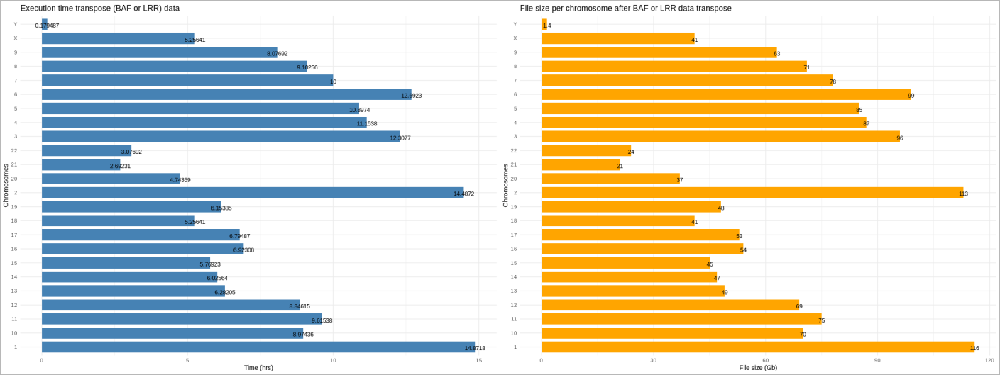

## Data input preparation

This section is specially made for research lab that want to prepare their CNV calling input files from the UKBB cohort. For those that are familiar with the UKBB (Uk biobank) cohort snp array genotyping data, it's easy to quickly realize that the data are presented in a high dimensional level and very high storage memory. The manipulation of these data is very challenging and for lab groups that do not have computational resources, this challenge difficulty might be increased.

Our goal in this section is to create a tool which will help researchers to better parse the UK biobank data at a low cost of computational resources and efficient execution time. The scripts are located in repository called "UKBB_DATA_GENERATOR". The image below shows a summary view of the data preparation protocol. To better understand the protocol, it's recommended to study the scripts and any constructive suggestion will be welcome and grateful.

<p align="center">
  
</p>
Before executing the analysis, here is an overview of the working repository.

```text
/BAFrawData
/BAFrawData/UKB_genotype_baf
/BAFrawData/UKB_genotype_baf/ukb_baf_chr1_v2.txt
...
/BAFrawData/UKB_genotype_baf/ukb_baf_chrY_v2.txt
/BAFrawData/UKB_genotype_baf/completeMergeBAF_chr1
...
/BAFrawData/UKB_genotype_baf/completeMergeBAF_chrY
/BAFrawData/UKB_genotype_baf/fragmentedBAF_chr1
...
/BAFrawData/UKB_genotype_baf/fragmentedBAF_chrY
/LRRrawData
/LRRrawData/UKB_genotype_l2r
/LRRrawData/UKB_genotype_l2r/ukb_l2r_chr1_v2.txt
...
/LRRrawData/UKB_genotype_l2r/ukb_l2r_chrY_v2.txt
/LRRrawData/UKB_genotype_l2r/completeMergeLRR_chr1
...
/LRRrawData/UKB_genotype_l2r/completeMergeLRR_chrY
/LRRrawData/UKB_genotype_l2r/fragmentedLRR_chr1
...
/LRRrawData/UKB_genotype_l2r/fragmentedLRR_chrY
/CRrawData
/CRrawData/UKB_genotype_con
/CRrawData/GCSCORErawData/ukb_con_chr1_v2.txt
...
/CRrawData/GCSCORErawData/ukb_con_chrY_v2.txt
/CRrawData/GCSCORErawData/completeMergeCR_chr1
...
/CRrawData/GCSCORErawData/completeMergeCR_chrY
/CRrawData/GCSCORErawData/fragmentedCR_chr1
...
/CRrawData/GCSCORErawData/fragmentedCR_chrY
/UKBB_fam_file/ukbb.fam
/SNPrawData/ukbbSNP_chr1.bim
...
/SNPrawData/ukbbSNP_chrY.bim
/OutputFinalReport_00
...
/OutputFinalReport_09
```

The scripts that help to format and generate the final reports should be located at:
```text
/~/MIND-GENESPARALLELCNV/UKBB_DATA_GENERATOR/formatUKBBdataToFinalReport.py
/~/MIND-GENESPARALLELCNV/UKBB_DATA_GENERATOR/generateFinalReportFromTransposeData.py
/~/MIND-GENESPARALLELCNV/UKBB_DATA_GENERATOR/warperForfileTranspose.sh
/~/MIND-GENESPARALLELCNV/UKBB_DATA_GENERATOR/warperForFinalreportOutput.sh
```
Before starting to extract reduced final report input for CNV calling from the UKBB big matrices, on need to reformat the raw downloaded data. As indicated in the summary image above, UKBB provide the BAF, LRR, Confidence Score in big high dimensional matrices. We also need to take in count that the sample and the SNP line up in the files remain the same in all of the other files.

1. To start formatting the raw data, the user should run the command line below, it can be run sequentially or in parallel. Three task is available in this plugin and the user is able to provide them in parameter. 
Lets run an example of the three available task in parallel:
```bash
bash ./warperForfileTranspose.sh 3 1 5 . BAF:LRR:CR
```
Thee above option will run 3 parallel tasks, each on a different processor. This is why the per task reserve RAM memory should be available on the computing machine, otherwise, the execution will raise and Out Of Memory error.
here is a definition of the above used parameter in the same order they were used:
```text
arg1: number of tasks
arg2: chromosome to analyze
arg3: required RAM memory to reserve for the process
arg4: root path to the raw data
arg5: the task option to execute
```
In the other hand, if one want to execute the process sequentially for any reason, here is a useful command line:
```bash
for option in BAF LRR CR
        do
        	bash ./warperForfileTranspose.sh 1 1 5 . "$option"
        done;
```
In the above case, the user is computing sequential jobs, therefore only one CPU is required while the amount of required memory remain unchanged.

Here is some execution graph results for the execution of an option as shown above:
<p align="center">

</p>


Now that the big transposed matrix is created, on can extract reduced final report for CNV calling from them. To do so, the user can use the provided script named "warperForFinalreportOutput.sh". The script is entirely parallel, and the command line bellow should do the jobs.
```bash
transposedData=/base_path_to_the_transposed_matrix/...
FRdirectory=/path_to_the_reduced_Final_report_output_results/...
bash ./warperForFinalreportOutput.sh 10 all $transposedData $FRdirectory
```
The above directory will execute 10 parallel tasks, each task is the extraction and writing of a different reduced final report data. The user must not forget that this process require at least 10 CPU cores to be available on the machine.
There is no need to worry about RAM memory usage, since the process does not buffer the whole transposed data in the available computer RAM. it only buffer ~12Mb x 2 of RAM, which represent one line per matrix, and therefore the required data to output a single reduced final report file. Once the the file is stored on the disk (wd), the RAM is cleared and ready for a next extraction. In conclusion, our example will use 10 cores of CPU and 240 Mb of RAM (10 cores x 12Mb x 2 lines).

In some cases, on might acquired illumina beadstudio final report which contained data for all individuals. Since the CNV caller require that the reduced final report to be splited individually, the user can use the provided per script by PennCNV called "split_illumina_report.pl", located at "~/PennCNV-1.0.5/" and work as below.

```bash
Usage:
     split_illumina_report.pl [arguments] <reportfile>

     Optional arguments:
            -v, --verbose                   use verbose output
            -h, --help                      print help message
            -m, --man                       print complete documentation
            -p, --prefix <string>           prefix of output file name
            -s, --suffix <string>           suffix of output file name
            -n, --numeric_name              use numeric file name (default: Sample ID is file name)
            -c, --comma                     fields are comma-delimited (default: fields are tab-delimited)
            -t, --tolerate                  tolerate records without LRR/BAF information
            -r, --revised_file <file>       path to "revised" file of alternate sample IDs
                --tolerate
``` 
One must be aware that header columns order will not necessarily be respected from a lab data to another, and that's the reason that we must always verify the column order. Lucky you !!!, we developed a data splitting procedure which take in count more parameters and take care of the BAF, LLR and the order variables in the matrix. The goal is not to make the process more complicated but instead to make the process more specific.
Some procedures require additional analysis on the genotyped markers. This mean, if a subset of SNP hasn't been well genotyped across the cohort, they got to be removed from the raw data, therefore this option is available from our script. The process cannot be paralleled since the algorithm need to read the file up until the end. The process execution time in linear O(n), but improvement will be applied by using file index jumper technique.

The scripts are available in the path "~/MIND-GENESPARALLELCNV/Illumina_beadStudio_data_splitter/SplittedIlluminaBeadStudioFinalReport.py" and can be executed as below. But before executing the scripts, the user must prepare a list of high quality SNPs (see the format below) and a list of sample ID which need to be extracted (see format below).

Example of SNP list file and it does not contain any header:

Example SNP_list.txt
```text
rs4477212	1	82154
rs3094315	1	752566
rs3131972	1	752721
rs12562034	1	768448
rs12124819	1	776546
rs11240777	1	798959
rs6681049	1	800007
```
Example sample_list.txt
```text
sampleID1
sampleID2
...
sampleIDn
```
Command line to execute the script, also python3 is required:

```bash
python3 SplittedIlluminaBeadStudioFinalReport.py ./path_to_beadstudion_FinalReport/BigIllumina_FinalReport.txt ./path_to_list_of_ID_to_be_extracted/sample_list.txt ./path_to_output_data_directory/Output_splitted_data ./path_to_snpList_file/SNP_list.txt
```

