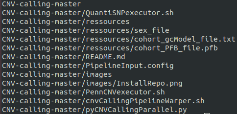

## Running the pipeline scripts


<p align="center">
  
</p>
1) First, one need to make sure that all individuals signal files are well formatted according to the bellow example. Name them as following: 

```list
SAMPLE_NAME_1.txt
SAMPLE_NAME_2.txt
...
SAMPLE_NAME_n.txt
```

Input signal file example:

Name | Chr | Position | Samplename.Log R Ratio | SampleName.B Allele Freq
---- | --- | -------- | ---------------------- | ------------------------
rs116720794 | 1 | 729632 | -0.083 | 1
rs3131972|1|752721|-0.202|0.533
rs12184325|1|754105|-0.152|1
rs3131962|1|756604|-0.286|0.535
rs114525117|1|759036|-0.097|1
rs3115850|1|761147|0.003|0.459
rs115991721|1|767096|0.013|0
rs12562034|1|768448|0.275|1
rs116390263|1|772927|0.352|0.997

For the remaining input file format, please refer to the PennCNV official readme web site.

2) Download the pipeline scripts and save them in the master project repository using the git commandline:
   
   ```bash
   git clone https://github.com/labjacquemont/MIND-GENESPARALLELCNV.git
   ```
   or

   ```bash
   git clone https://github.com/martineaujeanlouis/MIND-GENESPARALLELCNV.git
   ```
   
   then, 
   
   ```bash
   unzip MIND-GENESPARALLELCNV && cd MIND-GENESPARALLELCNV
   ```

The user project repository should look as below.


<p align="center">
  
</p>
Before running the pipeline, one need to compute the pfb file required by PennCNV.
To do so, the user should shuffle a list of at leat 300 samples from the project cohort and 
compute the population B allele frequency using the provided PennCNV plugins.
