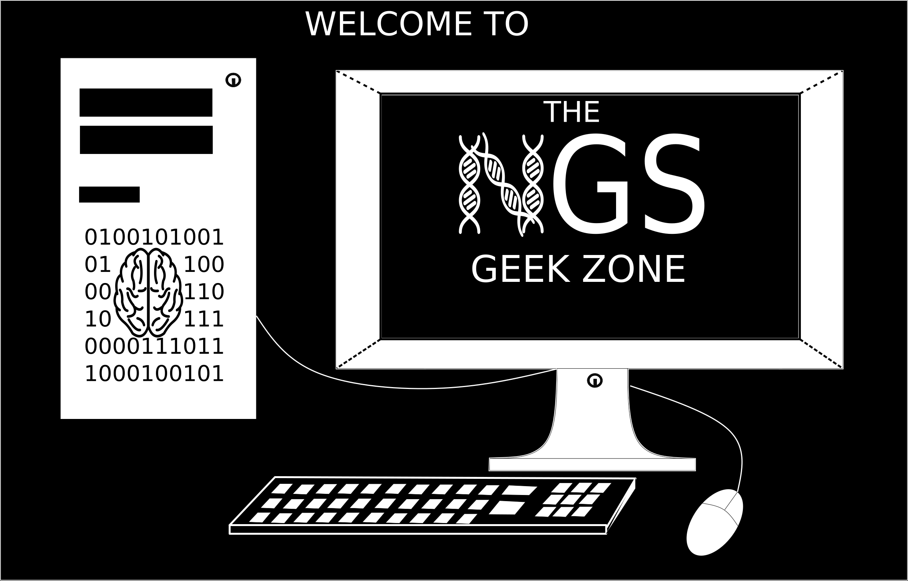

  

#### Description
Mind-GenesParallelCNV is freeware tool which mainly implemented to compute CNV calling parallel tasks in the most efficient method. The tool is design to make the command lines as much easier and simple as possible so that researchers form different informatics background level can integrate it in their research project. Also, It has been built to make the parallel tasks possible to be executed on any type of computer including desktops. The tools only work on linux64 for the moment. Other than focusing on calling CNV in parallel, the tool is meant to help detecting CNV using several type of callers based on different algorithms (implementation language may differ between algos). For the moment, the tool generates parallel calls from PennCNV and QuantiSNP, but other CNV caller such as IPattern, BCFtools, FastSeg, DNAcopy, etc will be implemented very soon so that better consensus results can be made available.

As indicated Mind&GenesParallelCNV is a freeware and opensource linux based tool, and users are free to suggest any improvement of it, and eventually digital and intellectual property laws are applied. Therefore, reference should be cited if this tool, any tools from this repo or any crosslinked tools from this repo  have been used in reasearch publication.

To know more about our lab research or our team, please reach the following link:

http://www.minds-genes.org/

#### __Author__:
#### Martineau Jean-Louis

#### __Contact__:
* matineau.jean-louis@umontreal.ca 
* martineau.jean-louis@recherche-ste-justine.qc.ca

This tool is implemented as collaboration to LabJacquemont

Click below to proceed to tutorial

<button class="button" style="vertical-align:middle" onclick="window.location.href = 'https://martineaujeanlouis.github.io/MIND-GENESPARALLELCNV/#/prepare_baff_lrr';">Tutorial </button>

